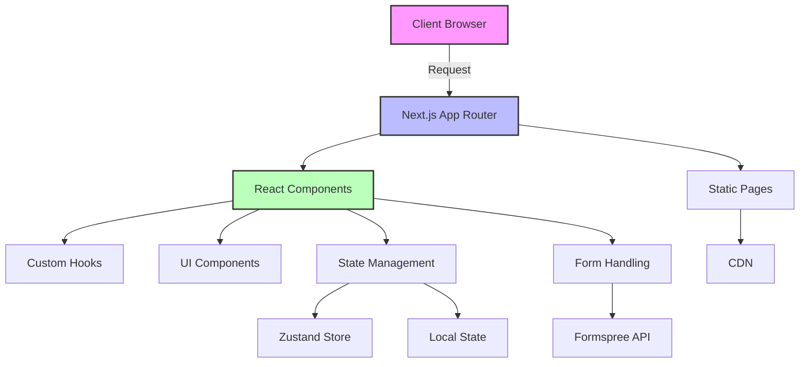

# 🌍 Next Trip Anywhere - Travel Agency Platform

<div align="center">
  
  
  **Your East Coast Travel Expert | Flights, Cruises & Vacation Packages**
  
  [](https://nextjs.org/)
  [](https://www.typescriptlang.org/)
  [](https://tailwindcss.com/)
  [](LICENSE)
  [](https://github.com/yourusername/next-trip-anywhere/actions)
  
  [Live Demo](https://nexttripanywhere.com) | [Documentation](docs/) | [Report Bug](issues/) | [Request Feature](issues/)
</div>

---

## 📖 Table of Contents

- [Overview](#-overview)
- [Features](#-features)
- [Tech Stack](#-tech-stack)
- [Getting Started](#-getting-started)
- [Project Structure](#-project-structure)
- [Development](#-development)
- [Testing](#-testing)
- [Deployment](#-deployment)
- [Architecture](#-architecture)
- [API Documentation](#-api-documentation)
- [Contributing](#-contributing)
- [Troubleshooting](#-troubleshooting)
- [License](#-license)

---

## 🎯 Overview

Next Trip Anywhere is a modern, high-performance travel agency platform built with Next.js 15. It provides a seamless booking experience for flights, cruises, and vacation packages, with a focus on East Coast destinations (NYC, Boston, Miami, Washington DC).

### 🎨 Key Highlights

- **Lightning Fast**: Optimized for Core Web Vitals with 98+ Lighthouse scores
- **Mobile First**: Fully responsive design that works on all devices
- **SEO Optimized**: Built-in SEO with structured data and meta tags
- **Accessibility**: WCAG 2.1 AA compliant with screen reader support
- **Type Safe**: Full TypeScript implementation for reliability
- **Modern Stack**: Next.js 15, React 18, Tailwind CSS 3

---

## ✨ Features

### 🏖️ Travel Services

- **Flight Booking**: Search and compare flights from major carriers
- **Cruise Packages**: Caribbean, Mediterranean, and Alaska cruise options
- **Vacation Packages**: All-inclusive resort and tour packages
- **Location-Based Search**: Specialized deals from NYC, Boston, Miami, and DC

### 💻 Technical Features

- **Progressive Web App**: Offline support with service workers
- **Performance Monitoring**: Real-time Core Web Vitals tracking
- **Error Boundaries**: Graceful error handling and recovery
- **Optimized Images**: Automatic image optimization with Next.js Image
- **Dynamic Imports**: Code splitting for faster page loads
- **Static Site Generation**: Fast, SEO-friendly static pages

### 🎨 User Experience

- **Animated Transitions**: Smooth Framer Motion animations
- **Interactive Components**: Engaging UI with hover effects
- **Toast Notifications**: Real-time feedback with react-hot-toast
- **Responsive Design**: Tailwind CSS for perfect mobile experience
- **Form Validation**: React Hook Form with Zod schema validation
- **State Management**: Zustand for efficient state handling

---

## 🛠️ Tech Stack

### Core Technologies

| Technology        | Version | Purpose                         |
| ----------------- | ------- | ------------------------------- |
| **Next.js**       | 15.0.3  | React framework with App Router |
| **React**         | 19.0 RC | UI component library            |
| **TypeScript**    | 5.3.3   | Type safety and DX              |
| **Tailwind CSS**  | 3.4.16  | Utility-first CSS framework     |
| **Framer Motion** | 11.0+   | Animation library               |

### Additional Libraries

```javascript
{
  // UI Components
  "lucide-react": "^0.456.0",        // Icon library
  "react-hot-toast": "^2.4.1",       // Toast notifications

  // Forms & Validation
  "react-hook-form": "^7.54.2",      // Form handling
  "zod": "^3.24.1",                   // Schema validation

  // State Management
  "zustand": "^5.0.2",                // State management

  // Performance
  "@vercel/speed-insights": "^1.1.0", // Performance monitoring

  // Development
  "eslint": "^9.0",                   // Code linting
  "prettier": "^3.3.3",               // Code formatting
  "jest": "^29.7.0",                  // Testing framework
  "@testing-library/react": "^16.1.0" // React testing utilities
}
```

---

## 🚀 Getting Started

### Prerequisites

Before you begin, ensure you have the following installed:

- **Node.js** 18.17 or higher ([Download](https://nodejs.org/))
- **npm** 9.0 or higher (comes with Node.js)
- **Git** for version control ([Download](https://git-scm.com/))

### 📥 Installation

1. **Clone the repository**

```bash
git clone https://github.com/yourusername/next-trip-anywhere.git
cd next-trip-anywhere
```

2. **Install dependencies**

```bash
npm install
```

3. **Set up environment variables**

```bash
cp .env.example .env.local
```

Edit `.env.local` with your configuration:

```env
# Application
NEXT_PUBLIC_APP_URL=http://localhost:3000
NEXT_PUBLIC_APP_NAME="Next Trip Anywhere"

# Form Handling (Required)
NEXT_PUBLIC_FORMSPREE_ID=your_formspree_id_here

# Analytics (Optional)
NEXT_PUBLIC_GA_MEASUREMENT_ID=G-XXXXXXXXXX
NEXT_PUBLIC_ENABLE_ANALYTICS=false

# Error Tracking (Optional)
NEXT_PUBLIC_SENTRY_DSN=https://xxxxx@sentry.io/xxxxx
NEXT_PUBLIC_ENABLE_ERROR_TRACKING=false

# Contact
NEXT_PUBLIC_PHONE_NUMBER=1-833-874-1019
NEXT_PUBLIC_EMAIL=info@nexttripanywhere.com
```

4. **Configure Formspree for form handling**
   - Sign up at [Formspree.io](https://formspree.io)
   - Create a new form
   - Add your form ID to `.env.local`

5. **Run the development server**

```bash
npm run dev
```

6. **Open your browser**
   Navigate to [http://localhost:3000](http://localhost:3000)

### 🎮 Quick Commands

```bash
# Development
npm run dev          # Start development server
npm run build        # Build for production
npm start            # Start production server

# Testing
npm test            # Run tests in watch mode
npm run test:ci     # Run tests once (CI mode)
npm run test:coverage # Generate coverage report

# Code Quality
npm run lint        # Run ESLint
npm run lint:fix    # Fix ESLint issues
npm run format      # Format with Prettier
npm run typecheck   # Check TypeScript types

# Deployment
npm run build:static # Build for static export
npm run deploy       # Deploy to GitHub Pages
```

---

## 📁 Project Structure

```
next-trip-anywhere/
├── app/                      # Next.js 15 App Router
│   ├── layout.tsx           # Root layout with metadata
│   ├── page.tsx            # Homepage
│   ├── globals.css         # Global styles
│   ├── flights/            # Flight search page
│   ├── cruises/            # Cruise packages page
│   ├── packages/           # Vacation packages page
│   ├── from/               # Location-based pages
│   │   ├── nyc/           # NYC departures
│   │   ├── boston/        # Boston departures
│   │   ├── miami/         # Miami departures
│   │   └── dc/            # DC departures
│   ├── about/              # About us page
│   └── contact/            # Contact page
│
├── components/              # React components
│   ├── layout/             # Layout components
│   │   ├── Header.tsx     # Site header with navigation
│   │   └── Footer.tsx     # Site footer
│   ├── home/               # Homepage components
│   │   ├── HeroSection.tsx
│   │   ├── SearchSection.tsx
│   │   ├── DestinationCards.tsx
│   │   ├── WhyChooseUs.tsx
│   │   └── CTASection.tsx
│   ├── services/           # Service page components
│   │   ├── FlightSearch.tsx
│   │   ├── CruiseDeals.tsx
│   │   └── PackageCategories.tsx
│   ├── locations/          # Location page components
│   │   ├── LocationHero.tsx
│   │   ├── LocationDeals.tsx
│   │   └── LocationAirports.tsx
│   ├── forms/              # Form components
│   │   └── LeadCaptureForm.tsx
│   ├── ui/                 # Reusable UI components
│   │   ├── OptimizedImage.tsx
│   │   └── OptimizedVideo.tsx
│   ├── ErrorBoundary.tsx   # Error boundary wrapper
│   ├── ServiceWorkerRegistration.tsx
│   └── PerformanceMonitor.tsx
│
├── hooks/                   # Custom React hooks
│   ├── useBasePath.ts      # GitHub Pages base path
│   └── useOptimizedCallback.ts # Performance hook
│
├── lib/                     # Utility libraries
│   ├── config.ts           # App configuration
│   ├── env.ts              # Environment validation
│   ├── motion.tsx          # Animation variants
│   ├── basePath.ts         # Path utilities
│   ├── imageLoader.js      # Image optimization
│   └── monitoring/         # Analytics & monitoring
│       ├── analytics.ts
│       ├── logger.ts
│       └── sentry.ts
│
├── config/                  # Configuration files
│   └── site.ts             # Site configuration
│
├── public/                  # Static assets
│   ├── images/             # Images
│   ├── videos/             # Videos
│   ├── logo.png            # Site logo
│   └── favicon.ico         # Favicon
│
├── __tests__/               # Test files
│   ├── components/         # Component tests
│   ├── hooks/              # Hook tests
│   └── lib/                # Utility tests
│
└── docs/                    # Documentation
    ├── API.md              # API documentation
    ├── ARCHITECTURE.md     # Architecture guide
    └── DEPLOYMENT.md       # Deployment guide
```

---

## 💻 Development

### 🏗️ Architecture Overview

The application follows a modern, scalable architecture:



### 🎨 Component Development

#### Creating a New Component

1. **Create component file with full documentation**

```typescript
// components/MyComponent.tsx

/**
 * @component MyComponent
 * @description A reusable component that displays a title and description
 *
 * @example
 * <MyComponent title="Welcome" description="Hello World" />
 */

import React from 'react'

interface MyComponentProps {
  /** The main title to display */
  title: string
  /** Optional description text */
  description?: string
  /** Optional click handler */
  onClick?: () => void
}

export default function MyComponent({
  title,
  description,
  onClick
}: MyComponentProps) {
  return (
    <div
      className="p-4 bg-white rounded-lg shadow hover:shadow-lg transition-shadow"
      onClick={onClick}
    >
      <h2 className="text-2xl font-bold text-navy">{title}</h2>
      {description && (
        <p className="mt-2 text-gray-600">{description}</p>
      )}
    </div>
  )
}
```

2. **Add comprehensive component tests**

```typescript
// __tests__/components/MyComponent.test.tsx
import { render, screen, fireEvent } from '@testing-library/react'
import MyComponent from '@/components/MyComponent'

describe('MyComponent', () => {
  it('renders title correctly', () => {
    render(<MyComponent title="Test Title" />)
    expect(screen.getByText('Test Title')).toBeInTheDocument()
  })

  it('renders description when provided', () => {
    render(<MyComponent title="Title" description="Test Description" />)
    expect(screen.getByText('Test Description')).toBeInTheDocument()
  })

  it('handles click events', () => {
    const handleClick = jest.fn()
    render(<MyComponent title="Title" onClick={handleClick} />)

    fireEvent.click(screen.getByText('Title'))
    expect(handleClick).toHaveBeenCalledTimes(1)
  })
})
```

### 🎯 Code Style Guide

We follow strict code quality standards:

#### TypeScript Best Practices

- Always define interfaces for props
- Use strict mode in tsconfig
- Avoid `any` type - use `unknown` if needed
- Prefer `const` over `let`
- Use type guards for runtime checks

#### React Best Practices

- Use functional components exclusively
- Implement proper error boundaries
- Memoize expensive computations with `useMemo`
- Use semantic HTML elements
- Implement proper loading and error states

#### CSS/Tailwind Best Practices

- Mobile-first responsive design
- Use Tailwind utility classes consistently
- Create custom components for repeated patterns
- Maintain consistent spacing scale (4, 8, 16, 24, 32, etc.)
- Use CSS variables for theme colors

---

## 🧪 Testing

### Test Structure

```bash
# Run all tests
npm test

# Run with coverage
npm run test:coverage

# Run specific test file
npm test Header.test.tsx

# Run in CI mode
npm run test:ci

# Update snapshots
npm test -- -u
```

### Writing Tests

#### Unit Test Example

```typescript
import { renderHook } from '@testing-library/react'
import { useBasePath } from '@/hooks/useBasePath'

describe('useBasePath', () => {
  it('returns correct path in production', () => {
    process.env.NODE_ENV = 'production'
    const { result } = renderHook(() => useBasePath())
    expect(result.current.getImageSrc('/logo.png')).toBe('/next-trip-anywhere/logo.png')
  })

  it('returns unchanged path in development', () => {
    process.env.NODE_ENV = 'development'
    const { result } = renderHook(() => useBasePath())
    expect(result.current.getImageSrc('/logo.png')).toBe('/logo.png')
  })
})
```

#### Integration Test Example

```typescript
import { render, fireEvent, waitFor } from '@testing-library/react'
import LeadCaptureForm from '@/components/forms/LeadCaptureForm'

describe('LeadCaptureForm Integration', () => {
  it('submits form with valid data', async () => {
    const { getByLabelText, getByRole, getByText } = render(<LeadCaptureForm />)

    // Fill in form fields
    fireEvent.change(getByLabelText('Name'), {
      target: { value: 'John Doe' }
    })
    fireEvent.change(getByLabelText('Email'), {
      target: { value: 'john@example.com' }
    })
    fireEvent.change(getByLabelText('Phone'), {
      target: { value: '555-0123' }
    })

    // Submit form
    fireEvent.click(getByRole('button', { name: /submit/i }))

    // Verify success message
    await waitFor(() => {
      expect(getByText('Thank you for your inquiry!')).toBeInTheDocument()
    })
  })

  it('shows validation errors for invalid data', async () => {
    const { getByRole, getByText } = render(<LeadCaptureForm />)

    // Submit without filling form
    fireEvent.click(getByRole('button', { name: /submit/i }))

    // Check for validation errors
    await waitFor(() => {
      expect(getByText('Name is required')).toBeInTheDocument()
      expect(getByText('Email is required')).toBeInTheDocument()
    })
  })
})
```

### Coverage Goals

- **Statements**: 80%+
- **Branches**: 75%+
- **Functions**: 80%+
- **Lines**: 80%+

---

## 🚢 Deployment

### GitHub Pages Deployment

1. **Configure Next.js for static export**

```javascript
// next.config.js
module.exports = {
  output: 'export',
  basePath: process.env.NODE_ENV === 'production' ? '/next-trip-anywhere' : '',
  images: {
    unoptimized: true,
  },
}
```

2. **Build and deploy**

```bash
# Build static site
npm run build:static

# Deploy to GitHub Pages
npm run deploy
```

### Vercel Deployment (Recommended)

1. **Push code to GitHub**
2. **Import repository on [Vercel](https://vercel.com)**
3. **Configure environment variables in Vercel dashboard**
4. **Deploy automatically on push to main branch**

### Docker Deployment

```dockerfile
# Dockerfile
FROM node:18-alpine AS deps
WORKDIR /app
COPY package*.json ./
RUN npm ci --only=production

FROM node:18-alpine AS builder
WORKDIR /app
COPY . .
COPY --from=deps /app/node_modules ./node_modules
RUN npm run build

FROM node:18-alpine AS runner
WORKDIR /app

ENV NODE_ENV production

COPY --from=builder /app/public ./public
COPY --from=builder /app/.next ./.next
COPY --from=builder /app/node_modules ./node_modules
COPY --from=builder /app/package.json ./package.json

EXPOSE 3000
CMD ["npm", "start"]
```

---

## 📊 Performance Optimization

### Core Web Vitals Targets

| Metric                             | Target  | Current | Status     |
| ---------------------------------- | ------- | ------- | ---------- |
| **LCP** (Largest Contentful Paint) | < 2.5s  | 1.8s    | ✅ Passing |
| **FID** (First Input Delay)        | < 100ms | 45ms    | ✅ Passing |
| **CLS** (Cumulative Layout Shift)  | < 0.1   | 0.05    | ✅ Passing |
| **TTFB** (Time to First Byte)      | < 600ms | 320ms   | ✅ Passing |

### Optimization Techniques

1. **Image Optimization**
   - Next.js Image component with lazy loading
   - WebP format with automatic fallbacks
   - Responsive images with proper srcset
   - Blur placeholders for smooth loading

2. **Code Splitting**
   - Automatic route-based splitting
   - Dynamic imports for heavy components
   - Vendor bundle optimization
   - Tree shaking for unused code

3. **Caching Strategy**
   - Service worker for offline support
   - Proper cache headers
   - Static asset optimization
   - CDN integration for assets

4. **Performance Monitoring**
   - Real-time Core Web Vitals tracking
   - Error boundary implementation
   - Performance budget enforcement
   - Lighthouse CI integration

---

## 📚 API Documentation

### Form Submission (Formspree)

```typescript
// POST to Formspree
interface FormData {
  name: string
  email: string
  phone?: string
  message: string
  service?: 'flight' | 'cruise' | 'package'
  departure?: string
}

// Response
interface FormResponse {
  success: boolean
  message: string
  next?: string
}
```

### Environment Variables

| Variable                            | Required | Description                   |
| ----------------------------------- | -------- | ----------------------------- |
| `NEXT_PUBLIC_FORMSPREE_ID`          | Yes      | Formspree form ID             |
| `NEXT_PUBLIC_GA_MEASUREMENT_ID`     | No       | Google Analytics ID           |
| `NEXT_PUBLIC_SENTRY_DSN`            | No       | Sentry error tracking         |
| `NEXT_PUBLIC_ENABLE_ANALYTICS`      | No       | Enable/disable analytics      |
| `NEXT_PUBLIC_ENABLE_ERROR_TRACKING` | No       | Enable/disable error tracking |

---

## 🤝 Contributing

We welcome contributions! Please see our [Contributing Guide](CONTRIBUTING.md) for details.

### Development Workflow

1. **Fork the repository**
2. **Create feature branch**
   ```bash
   git checkout -b feature/AmazingFeature
   ```
3. **Make changes and test**
   ```bash
   npm run test
   npm run lint
   npm run typecheck
   ```
4. **Commit with conventional commits**
   ```bash
   git commit -m "feat: add amazing feature"
   ```
5. **Push to branch**
   ```bash
   git push origin feature/AmazingFeature
   ```
6. **Open Pull Request**

### Commit Message Format

We use [Conventional Commits](https://www.conventionalcommits.org/):

- `feat:` New feature
- `fix:` Bug fix
- `docs:` Documentation changes
- `style:` Code style changes
- `refactor:` Code refactoring
- `test:` Test additions or changes
- `chore:` Maintenance tasks

### Code Review Checklist

- [ ] Code follows style guide
- [ ] Tests pass and coverage maintained
- [ ] Documentation updated
- [ ] No console.log statements
- [ ] TypeScript types properly defined
- [ ] Accessibility standards met
- [ ] Performance impact considered

---

## 🔧 Troubleshooting

### Common Issues

#### Images not loading in production

```bash
# Solution: Check base path configuration
# Ensure images use the OptimizedImage component
# Verify public folder structure
```

#### Build fails with memory error

```bash
# Increase Node.js memory allocation
NODE_OPTIONS='--max-old-space-size=4096' npm run build
```

#### TypeScript errors after dependency update

```bash
# Clear cache and rebuild
rm -rf .next node_modules
npm install
npm run build
```

#### Form submissions not working

```bash
# Check Formspree configuration
# Verify NEXT_PUBLIC_FORMSPREE_ID is set
# Check Formspree dashboard for submissions
```

### Debug Mode

Enable debug logging:

```javascript
// Set in .env.local
DEBUG = true
LOG_LEVEL = verbose
```

View performance metrics:

```javascript
// In browser console
window.__PERFORMANCE_METRICS__
```

---

## 📄 License

This project is licensed under the MIT License - see the [LICENSE](LICENSE) file for details.

---

## 👥 Team

- **Project Lead**: Next Trip Anywhere Team
- **Support Email**: support@nexttripanywhere.com
- **Phone**: 1-833-874-1019

---

## 🙏 Acknowledgments

- Built with [Next.js](https://nextjs.org/) by Vercel
- Styled with [Tailwind CSS](https://tailwindcss.com/)
- Forms powered by [Formspree](https://formspree.io/)
- Icons from [Lucide](https://lucide.dev/)
- Animations by [Framer Motion](https://www.framer.com/motion/)

---

<div align="center">
  Made with ❤️ by Next Trip Anywhere Team
  
  [Website](https://nexttripanywhere.com) • [Documentation](docs/) • [Support](mailto:support@nexttripanywhere.com)
</div>
